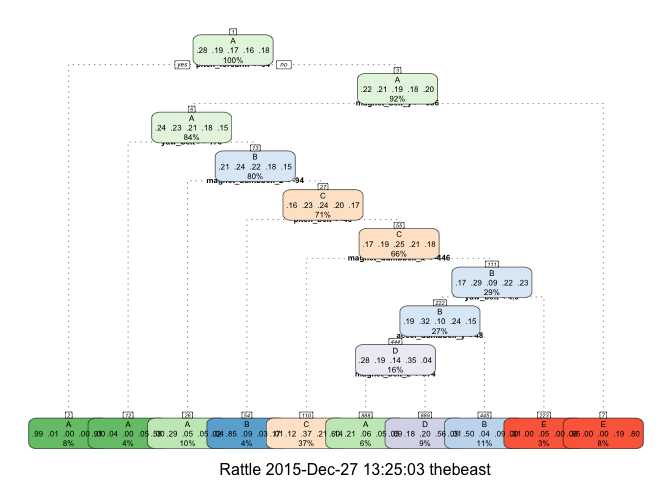

# Using Machine Learning to predict the manner in which they did the exercise based on monitor activity data
AKT  
December 25th, 2015  

##Summary
Human activity recognition research has traditionally focused on discriminating between different activities, i.e. to predict "which" activity was performed at a specific point in time (like with the Daily Living Activities dataset above). The approach we propose for the Weight Lifting Exercises dataset is to investigate "how (well)" an activity was performed by the wearer. The "how (well)" investigation has only received little attention so far, even though it potentially provides useful information for a large variety of applications,such as sports training.[Ref:http://groupware.les.inf.puc-rio.br/har#ixzz3vM4j8Pma]

##Objectives
The goal of our project is to predict the manner in which they did the exercise. This is the "classe" variable in the training set.The model will be used to predict 20 different test cases. To develop and define any predictive model(s) we need to produce/establish the following components.

###Question -> Input data -> Features -> Algorithm -> Parameters -> Evaluation.

##Analysis Details

####1. Question - Predict the manner in which the exercise was executed based on the characteristics/dimensions of the the available data set

####2. Input Data - Now we load our base data set and perform some data exploration to understand frequency and distribution of the different variables. 


```r
library(lubridate)
library(ggplot2)
library(lattice)
library(AppliedPredictiveModeling)
library(caret)
library(rattle)
```

```
## Rattle: A free graphical interface for data mining with R.
## Version 4.0.5 Copyright (c) 2006-2015 Togaware Pty Ltd.
## Type 'rattle()' to shake, rattle, and roll your data.
```

```r
library(rpart.plot)
```

```
## Loading required package: rpart
```

```r
library(randomForest)
```

```
## randomForest 4.6-12
## Type rfNews() to see new features/changes/bug fixes.
## 
## Attaching package: 'randomForest'
## 
## The following object is masked from 'package:ggplot2':
## 
##     margin
```

```r
urltrain <- "https://d396qusza40orc.cloudfront.net/predmachlearn/pml-training.csv"
TrainingDF <- read.csv(urltrain, header = TRUE, sep = ",", 
                               na.strings = c("NA", "","#DIV/0!"))
dim(TrainingDF)
```

```
## [1] 19622   160
```

```r
colnames_train <- colnames(TrainingDF)
urltest <- "https://d396qusza40orc.cloudfront.net/predmachlearn/pml-testing.csv"
TestDF <- read.csv(urltest,header = TRUE, sep = ",", 
                               na.strings = c("NA", "","#DIV/0!"))
dim(TestDF)
```

```
## [1]  20 160
```

```r
colnames_test <- colnames(TestDF)
# Verify that the column names (excluding classe and problem_id) are identical in the training and test set.
all.equal(colnames_train[1:length(colnames_train)-1], colnames_test[1:length(colnames_train)-1])
```

```
## [1] TRUE
```

Reviewing our Training Dataset we have determined that there are Six Particpants and Five Classes/Manners of Execution
Exactly according to the specification (Class A), throwing the elbows to the front (Class B), lifting the dumbbell only halfway (Class C), lowering the dumbbell only halfway (Class D) and throwing the hips to the front (Class E). This distribution is displayed in the Plot of Particpant Vs. Class. We see Class A being the predominant manner among all six particpants. [Ref:http://groupware.les.inf.puc-rio.br/har#ixzz3vM4j8Pma]

####Before we can identify the features we can leverage for our alogorithm and model we need to perform a cleanup and normalize for missing values & near zero values.Na values can cause unpredictable behavior and errors with ML functions. Drop un-needed columns to help with performance. Drop 1st 7 Columns as not relevant for predicting. Make sure columns are the same in both data sets.


```r
set.seed(12345)
# Count the number of non-NAs in each col.
nonNAs <- function(x) {
    as.vector(apply(x, 2, function(x) length(which(!is.na(x)))))
}
# Build vector of missing data or NA columns to drop.
colcnts <- nonNAs(TrainingDF)
drops <- c()
for (cnt in 1:length(colcnts)) {
    if (colcnts[cnt] < nrow(TrainingDF)) {
        drops <- c(drops, colnames_train[cnt])
    }
}
# Drop NA data and the first 7 columns as they're unnecessary for predicting.
TrainingDF <- TrainingDF[,!(names(TrainingDF) %in% drops)]
TrainingDF <- TrainingDF[,8:length(colnames(TrainingDF))]
TestDF <- TestDF[,!(names(TestDF) %in% drops)]
TestDF <- TestDF[,8:length(colnames(TestDF))]
```

####3. Features Identification and Selection-Identify the features which have the highest correlation to classe. Now we will only have relevant data for our model. These features of the data will allow us to predict the manner in which the activity was conducted based on other key data elements.


```r
#Feature Identification 
Results = which(names(TrainingDF) == "classe")
High_Correlation_Columns = findCorrelation(abs(cor(TrainingDF[,-Results])),0.90)
High_Correlation_Features = names(TrainingDF)[High_Correlation_Columns]
TrainingDF = TrainingDF[,-High_Correlation_Columns]
Results = which(names(TrainingDF) == "classe")
Results
```

```
## [1] 46
```

####4. Algorithms/ 5. Parameters - Now make the dataset more manageable and meaningful by partitioning the dataset.This is  good practice as the Training Data set is much larger than the limited test cases. For our analysis we have taken a 60% of Training and 40% of Testing Data. We will also improve the quality of the data by performing data cleansing and transformations steps before we do any further analysis.


```r
inTrain <- createDataPartition(TrainingDF$classe, p=0.6, list=FALSE)
Training_Subset <- TrainingDF[inTrain, ]
Testing_Subset <- TrainingDF[-inTrain, ]
dim(Training_Subset); dim(Testing_Subset)
```

```
## [1] 11776    46
```

```
## [1] 7846   46
```

```r
nzv <- nearZeroVar(Training_Subset, saveMetrics=TRUE)
Training_Subset <- Training_Subset[,nzv$nzv==FALSE]
nzv<- nearZeroVar(Testing_Subset,saveMetrics=TRUE)
Testing_Subset <- Testing_Subset[,nzv$nzv==FALSE]
```

####We develop two models and define the related algorithm and associated run parameters.As the outcomes are categorical, a decision tree is the first model tested using the method rpart with preprocessing and cross validation. The 2nd model developed is using the Random Forrest method also with cross validation and preprocessing. There is a risk of overifitting and preprocessing may not be needed  and may not be causing a significant improvement.

####rPart/Decision Tree  Model (Training Data set)


```r
modFit <- train(Training_Subset$classe ~ .,  trControl=trainControl(method = "cv", number = 4), data = Training_Subset, method="rpart")
print(modFit, digits=3)
```

```
## CART 
## 
## 11776 samples
##    45 predictor
##     5 classes: 'A', 'B', 'C', 'D', 'E' 
## 
## No pre-processing
## Resampling: Cross-Validated (4 fold) 
## Summary of sample sizes: 8832, 8832, 8832, 8832 
## Resampling results across tuning parameters:
## 
##   cp      Accuracy  Kappa  Accuracy SD  Kappa SD
##   0.0259  0.588     0.479  0.0298       0.0335  
##   0.0405  0.508     0.377  0.0231       0.0336  
##   0.0427  0.392     0.180  0.1240       0.2085  
## 
## Accuracy was used to select the optimal model using  the largest value.
## The final value used for the model was cp = 0.0259.
```

```r
fancyRpartPlot(modFit$finalModel,cex=.5,under.cex=1,shadow.offset=0)
```

 

```r
predictions <- predict(modFit, newdata=Training_Subset)
print(confusionMatrix(predictions, Training_Subset$classe), digits=4)
```

```
## Confusion Matrix and Statistics
## 
##           Reference
## Prediction    A    B    C    D    E
##          A 2489  508   96  124  111
##          B   79 1066   99  135  406
##          C  719  511 1627  899  597
##          D   59  192  214  600    9
##          E    2    2   18  172 1042
## 
## Overall Statistics
##                                           
##                Accuracy : 0.5795          
##                  95% CI : (0.5705, 0.5884)
##     No Information Rate : 0.2843          
##     P-Value [Acc > NIR] : < 2.2e-16       
##                                           
##                   Kappa : 0.4688          
##  Mcnemar's Test P-Value : < 2.2e-16       
## 
## Statistics by Class:
## 
##                      Class: A Class: B Class: C Class: D Class: E
## Sensitivity            0.7434  0.46775   0.7921  0.31088  0.48129
## Specificity            0.9005  0.92429   0.7196  0.95186  0.97981
## Pos Pred Value         0.7479  0.59720   0.3738  0.55866  0.84304
## Neg Pred Value         0.8983  0.87859   0.9425  0.87572  0.89345
## Prevalence             0.2843  0.19353   0.1744  0.16389  0.18385
## Detection Rate         0.2114  0.09052   0.1382  0.05095  0.08849
## Detection Prevalence   0.2826  0.15158   0.3697  0.09120  0.10496
## Balanced Accuracy      0.8219  0.69602   0.7559  0.63137  0.73055
```

####Random Forrest Model (Training Data set) Now train the model using the test dataset. Apply cross validation and preprocessing 


```r
modFit_rm <- train(Training_Subset$classe ~ ., method="rf", preProcess=c("center", "scale"), trControl=trainControl(method = "cv", number = 4), data=Training_Subset)
print(modFit_rm, digits=3)
```

```
## Random Forest 
## 
## 11776 samples
##    45 predictor
##     5 classes: 'A', 'B', 'C', 'D', 'E' 
## 
## Pre-processing: centered (45), scaled (45) 
## Resampling: Cross-Validated (4 fold) 
## Summary of sample sizes: 8832, 8830, 8834, 8832 
## Resampling results across tuning parameters:
## 
##   mtry  Accuracy  Kappa  Accuracy SD  Kappa SD
##    2    0.984     0.980  0.00406      0.00514 
##   23    0.988     0.984  0.00371      0.00469 
##   45    0.984     0.979  0.00266      0.00337 
## 
## Accuracy was used to select the optimal model using  the largest value.
## The final value used for the model was mtry = 23.
```

```r
predictions_rm <- predict(modFit_rm, newdata=Training_Subset)
print(confusionMatrix(predictions_rm, Training_Subset$classe), digits=4)
```

```
## Confusion Matrix and Statistics
## 
##           Reference
## Prediction    A    B    C    D    E
##          A 3348    0    0    0    0
##          B    0 2279    0    0    0
##          C    0    0 2054    0    0
##          D    0    0    0 1930    0
##          E    0    0    0    0 2165
## 
## Overall Statistics
##                                      
##                Accuracy : 1          
##                  95% CI : (0.9997, 1)
##     No Information Rate : 0.2843     
##     P-Value [Acc > NIR] : < 2.2e-16  
##                                      
##                   Kappa : 1          
##  Mcnemar's Test P-Value : NA         
## 
## Statistics by Class:
## 
##                      Class: A Class: B Class: C Class: D Class: E
## Sensitivity            1.0000   1.0000   1.0000   1.0000   1.0000
## Specificity            1.0000   1.0000   1.0000   1.0000   1.0000
## Pos Pred Value         1.0000   1.0000   1.0000   1.0000   1.0000
## Neg Pred Value         1.0000   1.0000   1.0000   1.0000   1.0000
## Prevalence             0.2843   0.1935   0.1744   0.1639   0.1838
## Detection Rate         0.2843   0.1935   0.1744   0.1639   0.1838
## Detection Prevalence   0.2843   0.1935   0.1744   0.1639   0.1838
## Balanced Accuracy      1.0000   1.0000   1.0000   1.0000   1.0000
```

####6. Evaluation - On evaluating both the models it is observed that the Random Forrest model(method) gives a 100% accuracy with the Test Data Set Vs. the rPart(Decision Tree) method which only gives us 50% accuracy on the test data.

####rPart (Testing Data set)- Now train the model using the test dataset. Apply cross validation but no preprocessing


```r
modFit <- train(Testing_Subset$classe ~ .,  trControl=trainControl(method = "cv", number = 4), data = Testing_Subset, method="rpart")
print(modFit, digits=3)
```

```
## CART 
## 
## 7846 samples
##   45 predictor
##    5 classes: 'A', 'B', 'C', 'D', 'E' 
## 
## No pre-processing
## Resampling: Cross-Validated (4 fold) 
## Summary of sample sizes: 5883, 5885, 5884, 5886 
## Resampling results across tuning parameters:
## 
##   cp      Accuracy  Kappa  Accuracy SD  Kappa SD
##   0.0296  0.510     0.362  0.01927      0.02585 
##   0.0312  0.490     0.334  0.00516      0.00693 
##   0.0676  0.424     0.231  0.09306      0.15419 
## 
## Accuracy was used to select the optimal model using  the largest value.
## The final value used for the model was cp = 0.0296.
```

```r
predictions <- predict(modFit, newdata=Testing_Subset)
print(confusionMatrix(predictions, Testing_Subset$classe), digits=4)
```

```
## Confusion Matrix and Statistics
## 
##           Reference
## Prediction    A    B    C    D    E
##          A 2015  559  612  487  310
##          B   49  500   40   25  230
##          C  167  404  709  454  353
##          D    0   49    3  224   72
##          E    1    6    4   96  477
## 
## Overall Statistics
##                                           
##                Accuracy : 0.5003          
##                  95% CI : (0.4891, 0.5114)
##     No Information Rate : 0.2845          
##     P-Value [Acc > NIR] : < 2.2e-16       
##                                           
##                   Kappa : 0.3488          
##  Mcnemar's Test P-Value : < 2.2e-16       
## 
## Statistics by Class:
## 
##                      Class: A Class: B Class: C Class: D Class: E
## Sensitivity            0.9028  0.32938  0.51827  0.17418  0.33079
## Specificity            0.6494  0.94564  0.78728  0.98110  0.98329
## Pos Pred Value         0.5059  0.59242  0.33972  0.64368  0.81678
## Neg Pred Value         0.9438  0.85461  0.88557  0.85836  0.86712
## Prevalence             0.2845  0.19347  0.17436  0.16391  0.18379
## Detection Rate         0.2568  0.06373  0.09036  0.02855  0.06080
## Detection Prevalence   0.5076  0.10757  0.26600  0.04435  0.07443
## Balanced Accuracy      0.7761  0.63751  0.65278  0.57764  0.65704
```

####Random Forrest (Testing Data set)


```r
modFit_rm <- train(Testing_Subset$classe ~ ., method="rf", preProcess=c("center", "scale"), trControl=trainControl(method = "cv", number = 4), data=Testing_Subset)
print(modFit_rm, digits=3)
```

```
## Random Forest 
## 
## 7846 samples
##   45 predictor
##    5 classes: 'A', 'B', 'C', 'D', 'E' 
## 
## Pre-processing: centered (45), scaled (45) 
## Resampling: Cross-Validated (4 fold) 
## Summary of sample sizes: 5884, 5886, 5884, 5884 
## Resampling results across tuning parameters:
## 
##   mtry  Accuracy  Kappa  Accuracy SD  Kappa SD
##    2    0.978     0.972  0.00353      0.00447 
##   23    0.982     0.977  0.00451      0.00572 
##   45    0.973     0.966  0.00533      0.00674 
## 
## Accuracy was used to select the optimal model using  the largest value.
## The final value used for the model was mtry = 23.
```

```r
predictions_rm <- predict(modFit_rm, newdata=Testing_Subset)
print(confusionMatrix(predictions_rm, Testing_Subset$classe), digits=4)
```

```
## Confusion Matrix and Statistics
## 
##           Reference
## Prediction    A    B    C    D    E
##          A 2232    0    0    0    0
##          B    0 1518    0    0    0
##          C    0    0 1368    0    0
##          D    0    0    0 1286    0
##          E    0    0    0    0 1442
## 
## Overall Statistics
##                                      
##                Accuracy : 1          
##                  95% CI : (0.9995, 1)
##     No Information Rate : 0.2845     
##     P-Value [Acc > NIR] : < 2.2e-16  
##                                      
##                   Kappa : 1          
##  Mcnemar's Test P-Value : NA         
## 
## Statistics by Class:
## 
##                      Class: A Class: B Class: C Class: D Class: E
## Sensitivity            1.0000   1.0000   1.0000   1.0000   1.0000
## Specificity            1.0000   1.0000   1.0000   1.0000   1.0000
## Pos Pred Value         1.0000   1.0000   1.0000   1.0000   1.0000
## Neg Pred Value         1.0000   1.0000   1.0000   1.0000   1.0000
## Prevalence             0.2845   0.1935   0.1744   0.1639   0.1838
## Detection Rate         0.2845   0.1935   0.1744   0.1639   0.1838
## Detection Prevalence   0.2845   0.1935   0.1744   0.1639   0.1838
## Balanced Accuracy      1.0000   1.0000   1.0000   1.0000   1.0000
```

####In Sample & Out of Sample Error Review


```r
InpredictionTesting = predict(modFit_rm, newdata = Testing_Subset)
confusionMatrix(InpredictionTesting, Testing_Subset$classe)
```

```
## Confusion Matrix and Statistics
## 
##           Reference
## Prediction    A    B    C    D    E
##          A 2232    0    0    0    0
##          B    0 1518    0    0    0
##          C    0    0 1368    0    0
##          D    0    0    0 1286    0
##          E    0    0    0    0 1442
## 
## Overall Statistics
##                                      
##                Accuracy : 1          
##                  95% CI : (0.9995, 1)
##     No Information Rate : 0.2845     
##     P-Value [Acc > NIR] : < 2.2e-16  
##                                      
##                   Kappa : 1          
##  Mcnemar's Test P-Value : NA         
## 
## Statistics by Class:
## 
##                      Class: A Class: B Class: C Class: D Class: E
## Sensitivity            1.0000   1.0000   1.0000   1.0000   1.0000
## Specificity            1.0000   1.0000   1.0000   1.0000   1.0000
## Pos Pred Value         1.0000   1.0000   1.0000   1.0000   1.0000
## Neg Pred Value         1.0000   1.0000   1.0000   1.0000   1.0000
## Prevalence             0.2845   0.1935   0.1744   0.1639   0.1838
## Detection Rate         0.2845   0.1935   0.1744   0.1639   0.1838
## Detection Prevalence   0.2845   0.1935   0.1744   0.1639   0.1838
## Balanced Accuracy      1.0000   1.0000   1.0000   1.0000   1.0000
```

```r
OutpredictionTesting = predict(modFit_rm, newdata = Training_Subset)
confusionMatrix(OutpredictionTesting, Training_Subset$classe)
```

```
## Confusion Matrix and Statistics
## 
##           Reference
## Prediction    A    B    C    D    E
##          A 3339   39    0    0    0
##          B    4 2225   41    2    1
##          C    1   12 1996   21    5
##          D    1    1   10 1901    7
##          E    3    2    7    6 2152
## 
## Overall Statistics
##                                           
##                Accuracy : 0.9862          
##                  95% CI : (0.9839, 0.9882)
##     No Information Rate : 0.2843          
##     P-Value [Acc > NIR] : < 2e-16         
##                                           
##                   Kappa : 0.9825          
##  Mcnemar's Test P-Value : 4.2e-08         
## 
## Statistics by Class:
## 
##                      Class: A Class: B Class: C Class: D Class: E
## Sensitivity            0.9973   0.9763   0.9718   0.9850   0.9940
## Specificity            0.9954   0.9949   0.9960   0.9981   0.9981
## Pos Pred Value         0.9885   0.9789   0.9808   0.9901   0.9917
## Neg Pred Value         0.9989   0.9943   0.9940   0.9971   0.9986
## Prevalence             0.2843   0.1935   0.1744   0.1639   0.1838
## Detection Rate         0.2835   0.1889   0.1695   0.1614   0.1827
## Detection Prevalence   0.2869   0.1930   0.1728   0.1630   0.1843
## Balanced Accuracy      0.9963   0.9856   0.9839   0.9915   0.9961
```

For the random forest model used the in sample error rate is 0; the model is 100% (Reference: Random Forrest (Training Data set)) - Confusion Matrix (In Sample error based on the same data set) accurate when used on the original testing data set and 98.62 when used on another data set (Out of Sample error). This looks too good to be true and is most likely due to overfitting of the data to the model or having too small a sample size (Only 6 Patricipants) for test cases. Additionally the data set could vary based on when it was taken and is essentially a small sample of a larger homogenous dataset.

####Validate the Model Predictions against the Test Data Set.


```r
Validate_Prediction <- predict(modFit_rm, newdata=TestDF)
Validate_Prediction
```

```
##  [1] B A B A A C D B A A B C B A E E A B B B
## Levels: A B C D E
```

##Conclusion
Random Forest was a superior model for prediction compared to rpart. The decision tree model was dependent on various variables and the interaction between them which caused the model to be inadequate. The Random Forrest model had over 98.6% accuracy and fitted well to other subsamples of the data. However, the algorithm may not have as high of accuracy on other samples,especially with a more varied subject pool. 
Overall, it is interesting to consider how monitors are affected by the way an execrise was conducted relative to other data points collected by the monitor to infer the subjects activities.
