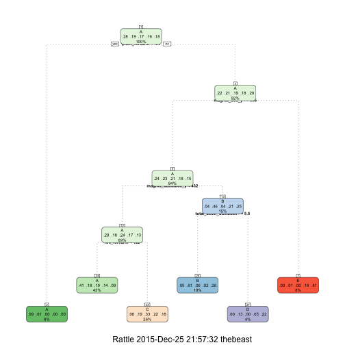

##Summary
Human activity recognition research has traditionally focused on discriminating between different activities, i.e. to predict "which" activity was performed at a specific point in time (like with the Daily Living Activities dataset above). The approach we propose for the Weight Lifting Exercises dataset is to investigate "how (well)" an activity was performed by the wearer. The "how (well)" investigation has only received little attention so far, even though it potentially provides useful information for a large variety of applications,such as sports training.[Ref:http://groupware.les.inf.puc-rio.br/har#ixzz3vM4j8Pma]

##Objectives
The goal of our project is to predict the manner in which they did the exercise. This is the "classe" variable in the training set.The model will be used to predict 20 different test cases. To develop and define any predictive model(s) we need to produce/establish the following components.question -> input data -> features -> algorithm -> parameters -> evaluation.

#####1. Question - Predict "The manner in which the exercise was executed based on the charateristics/dimensions of the the available data set

#####2. Input Data - Now we load our base data set and perfrom some data exploration to understand frequency and distribution of the different variables. 


```r
library(lubridate)
library(ggplot2)
library(lattice)
library(AppliedPredictiveModeling)
library(caret)
library(rattle)
```

```
## R session is headless; GTK+ not initialized.
## Rattle: A free graphical interface for data mining with R.
## Version 4.0.5 Copyright (c) 2006-2015 Togaware Pty Ltd.
## Type 'rattle()' to shake, rattle, and roll your data.
```

```r
library(rpart.plot)
```

```
## Loading required package: rpart
```

```r
library(randomForest)
```

```
## randomForest 4.6-12
## Type rfNews() to see new features/changes/bug fixes.
## 
## Attaching package: 'randomForest'
## 
## The following object is masked from 'package:ggplot2':
## 
##     margin
```

```r
urltrain <- "https://d396qusza40orc.cloudfront.net/predmachlearn/pml-training.csv"
TrainingDF <- read.csv(urltrain, header = TRUE, sep = ",", 
                               na.strings = c("NA", "","#DIV/0!"))
dim(TrainingDF)
```

```
## [1] 19622   160
```

```r
colnames_train <- colnames(TrainingDF)
urltest <- "https://d396qusza40orc.cloudfront.net/predmachlearn/pml-testing.csv"
TestDF <- read.csv(urltest,header = TRUE, sep = ",", 
                               na.strings = c("NA", "","#DIV/0!"))
dim(TestDF)
```

```
## [1]  20 160
```

```r
colnames_test <- colnames(TestDF)
# Verify that the column names (excluding classe and problem_id) are identical in the training and test set.
all.equal(colnames_train[1:length(colnames_train)-1], colnames_test[1:length(colnames_train)-1])
```

```
## [1] TRUE
```

Reviewing our Training Dataset we have determined that there are Six Particpants and Five Classes/Manners of Execution
Exactly according to the specification (Class A), throwing the elbows to the front (Class B), lifting the dumbbell only halfway (Class C), lowering the dumbbell only halfway (Class D) and throwing the hips to the front (Class E). This distribution is displayed in the Plot of Particpant Vs. Class. We see Class A being the predominant manner among all six particpants. [Ref:http://groupware.les.inf.puc-rio.br/har#ixzz3vM4j8Pma]

#####3. Features - Perform cleanup and normalize for missing values & near zero values.Drop un-needed columns. Drop 1st 7 Columns as not relevant for predicting - Important Features can be determined by actually leveraging the random forrest model to indintify the features which have the highest correlation to classe. Now we will only have relevant data for our model. These features of the data will allow us to predict the manner in which the activity was conducted based on other key data elements.

```r
set.seed(12345)
# Count the number of non-NAs in each col.
nonNAs <- function(x) {
    as.vector(apply(x, 2, function(x) length(which(!is.na(x)))))
}
# Build vector of missing data or NA columns to drop.
colcnts <- nonNAs(TrainingDF)
drops <- c()
for (cnt in 1:length(colcnts)) {
    if (colcnts[cnt] < nrow(TrainingDF)) {
        drops <- c(drops, colnames_train[cnt])
    }
}
# Drop NA data and the first 7 columns as they're unnecessary for predicting.
TrainingDF <- TrainingDF[,!(names(TrainingDF) %in% drops)]
TrainingDF <- TrainingDF[,8:length(colnames(TrainingDF))]
TestDF <- TestDF[,!(names(TestDF) %in% drops)]
TestDF <- TestDF[,8:length(colnames(TestDF))]
#Feature Identification 
Results = which(names(TrainingDF) == "classe")
High_Correlation_Columns = findCorrelation(abs(cor(TrainingDF[,-Results])),0.90)
High_Correlation_Features = names(TrainingDF)[High_Correlation_Columns]
TrainingDF = TrainingDF[,-High_Correlation_Columns]
Results = which(names(TrainingDF) == "classe")
#Feature Ranking and Significance
fsRF = randomForest(TrainingDF[,-Results], TrainingDF[,Results], importance = T)
rfImp = data.frame(fsRF$importance)
impFeatures = order(-rfImp$MeanDecreaseGini)
inImp = createDataPartition(data$classe, p = 0.05, list = F)
```

```
## Error in data$classe: object of type 'closure' is not subsettable
```

```r
featurePlot(TrainingDF[inImp,impFeatures[1:4]],TrainingDF$classe[inImp], plot = "pairs")
```

```
## Error in `[.data.frame`(TrainingDF, inImp, impFeatures[1:4]): object 'inImp' not found
```

#####4. Algorithms/ 5. Parameters - Now make the dataset more manageable and meaningful by partitioning the dataset.This is  good practice as the Training Data set is much larger than the limited test cases. For our analysis we have taken a 60% of Training and 40% of Testing Data. We will also improve the quality of the data by performing data cleansing and transformations steps before we do any further analysis.


```r
inTrain <- createDataPartition(TrainingDF$classe, p=0.6, list=FALSE)
Training_Subset <- TrainingDF[inTrain, ]
Testing_Subset <- TrainingDF[-inTrain, ]
dim(Training_Subset); dim(Testing_Subset)
```

```
## [1] 11776    46
```

```
## [1] 7846   46
```

```r
nzv <- nearZeroVar(Training_Subset, saveMetrics=TRUE)
Training_Subset <- Training_Subset[,nzv$nzv==FALSE]
nzv<- nearZeroVar(Testing_Subset,saveMetrics=TRUE)
Testing_Subset <- Testing_Subset[,nzv$nzv==FALSE]
```

#####We develop two models and define the related algorithm and associated run parameters.As the outcomes are categorical, a decision tree is the first model tested using the method rpart with preprocessing and cross validation. The 2nd model developed is using the Random Forrest method also with cross validation and preprocessing. There is a risk of overifitting and preprocessing may not be needed  and may not be causing a significant improvement.

######rPart/Decision Tree  Model on the Training Dataset

```r
modFit <- train(Training_Subset$classe ~ .,  trControl=trainControl(method = "cv", number = 4), data = Training_Subset, method="rpart")
print(modFit, digits=3)
```

```
## CART 
## 
## 11776 samples
##    45 predictor
##     5 classes: 'A', 'B', 'C', 'D', 'E' 
## 
## No pre-processing
## Resampling: Cross-Validated (4 fold) 
## Summary of sample sizes: 8832, 8832, 8831, 8833 
## Resampling results across tuning parameters:
## 
##   cp      Accuracy  Kappa  Accuracy SD  Kappa SD
##   0.0318  0.500     0.348  0.0281       0.0377  
##   0.0322  0.484     0.325  0.0136       0.0185  
##   0.0662  0.375     0.151  0.1051       0.1744  
## 
## Accuracy was used to select the optimal model using  the largest value.
## The final value used for the model was cp = 0.0318.
```

```r
fancyRpartPlot(modFit$finalModel,cex=.5,under.cex=1,shadow.offset=0)
```

 

```r
predictions <- predict(modFit, newdata=Training_Subset)
print(confusionMatrix(predictions, Training_Subset$classe), digits=4)
```

```
## Confusion Matrix and Statistics
## 
##           Reference
## Prediction    A    B    C    D    E
##          A 3048  905  968  712  466
##          B   62  731   68   28  309
##          C  236  568 1014  685  559
##          D    0   70    2  341  115
##          E    2    5    2  164  716
## 
## Overall Statistics
##                                           
##                Accuracy : 0.4968          
##                  95% CI : (0.4877, 0.5058)
##     No Information Rate : 0.2843          
##     P-Value [Acc > NIR] : < 2.2e-16       
##                                           
##                   Kappa : 0.3435          
##  Mcnemar's Test P-Value : < 2.2e-16       
## 
## Statistics by Class:
## 
##                      Class: A Class: B Class: C Class: D Class: E
## Sensitivity            0.9104  0.32075  0.49367  0.17668  0.33072
## Specificity            0.6380  0.95083  0.78934  0.98101  0.98200
## Pos Pred Value         0.4998  0.61018  0.33116  0.64583  0.80540
## Neg Pred Value         0.9472  0.85366  0.88065  0.85873  0.86691
## Prevalence             0.2843  0.19353  0.17442  0.16389  0.18385
## Detection Rate         0.2588  0.06208  0.08611  0.02896  0.06080
## Detection Prevalence   0.5179  0.10173  0.26002  0.04484  0.07549
## Balanced Accuracy      0.7742  0.63579  0.64151  0.57885  0.65636
```
#####Random Forrest Model on the Training Dataset

```r
modFit_rm <- train(Training_Subset$classe ~ ., method="rf", preProcess=c("center", "scale"), trControl=trainControl(method = "cv", number = 4), data=Training_Subset)
print(modFit_rm, digits=3)
```

```
## Random Forest 
## 
## 11776 samples
##    45 predictor
##     5 classes: 'A', 'B', 'C', 'D', 'E' 
## 
## Pre-processing: centered (45), scaled (45) 
## Resampling: Cross-Validated (4 fold) 
## Summary of sample sizes: 8832, 8832, 8832, 8832 
## Resampling results across tuning parameters:
## 
##   mtry  Accuracy  Kappa  Accuracy SD  Kappa SD
##    2    0.985     0.981  0.00186      0.00235 
##   23    0.989     0.986  0.00295      0.00374 
##   45    0.982     0.977  0.00638      0.00807 
## 
## Accuracy was used to select the optimal model using  the largest value.
## The final value used for the model was mtry = 23.
```

```r
predictions_rm <- predict(modFit_rm, newdata=Training_Subset)
print(confusionMatrix(predictions_rm, Training_Subset$classe), digits=4)
```

```
## Confusion Matrix and Statistics
## 
##           Reference
## Prediction    A    B    C    D    E
##          A 3348    0    0    0    0
##          B    0 2279    0    0    0
##          C    0    0 2054    0    0
##          D    0    0    0 1930    0
##          E    0    0    0    0 2165
## 
## Overall Statistics
##                                      
##                Accuracy : 1          
##                  95% CI : (0.9997, 1)
##     No Information Rate : 0.2843     
##     P-Value [Acc > NIR] : < 2.2e-16  
##                                      
##                   Kappa : 1          
##  Mcnemar's Test P-Value : NA         
## 
## Statistics by Class:
## 
##                      Class: A Class: B Class: C Class: D Class: E
## Sensitivity            1.0000   1.0000   1.0000   1.0000   1.0000
## Specificity            1.0000   1.0000   1.0000   1.0000   1.0000
## Pos Pred Value         1.0000   1.0000   1.0000   1.0000   1.0000
## Neg Pred Value         1.0000   1.0000   1.0000   1.0000   1.0000
## Prevalence             0.2843   0.1935   0.1744   0.1639   0.1838
## Detection Rate         0.2843   0.1935   0.1744   0.1639   0.1838
## Detection Prevalence   0.2843   0.1935   0.1744   0.1639   0.1838
## Balanced Accuracy      1.0000   1.0000   1.0000   1.0000   1.0000
```

#####6. Evaluation - On evaluating both the models it is observed that the Random Forrest model(method) gives a 100% accuracy with the Test Data Set Vs. the rPart(Decision Tree) method which only gives us 49% accuracy.
######rPart 

```r
modFit <- train(Testing_Subset$classe ~ .,  trControl=trainControl(method = "cv", number = 4), data = Testing_Subset, method="rpart")
print(modFit, digits=3)
```

```
## CART 
## 
## 7846 samples
##   45 predictor
##    5 classes: 'A', 'B', 'C', 'D', 'E' 
## 
## No pre-processing
## Resampling: Cross-Validated (4 fold) 
## Summary of sample sizes: 5885, 5884, 5884, 5885 
## Resampling results across tuning parameters:
## 
##   cp      Accuracy  Kappa  Accuracy SD  Kappa SD
##   0.0299  0.510     0.365  0.0361       0.0552  
##   0.0306  0.510     0.365  0.0361       0.0552  
##   0.0669  0.375     0.151  0.1051       0.1745  
## 
## Accuracy was used to select the optimal model using  the largest value.
## The final value used for the model was cp = 0.0306.
```

```r
predictions <- predict(modFit, newdata=Testing_Subset)
print(confusionMatrix(predictions, Testing_Subset$classe), digits=4)
```

```
## Confusion Matrix and Statistics
## 
##           Reference
## Prediction    A    B    C    D    E
##          A 2018  629  601  506  308
##          B   44  521   51  236  283
##          C  169  366  715  442  371
##          D    0    0    0    0    0
##          E    1    2    1  102  480
## 
## Overall Statistics
##                                          
##                Accuracy : 0.4759         
##                  95% CI : (0.4648, 0.487)
##     No Information Rate : 0.2845         
##     P-Value [Acc > NIR] : < 2.2e-16      
##                                          
##                   Kappa : 0.3151         
##  Mcnemar's Test P-Value : < 2.2e-16      
## 
## Statistics by Class:
## 
##                      Class: A Class: B Class: C Class: D Class: E
## Sensitivity            0.9041   0.3432  0.52266   0.0000  0.33287
## Specificity            0.6359   0.9030  0.79191   1.0000  0.98345
## Pos Pred Value         0.4968   0.4590  0.34658      NaN  0.81911
## Neg Pred Value         0.9434   0.8514  0.88708   0.8361  0.86749
## Prevalence             0.2845   0.1935  0.17436   0.1639  0.18379
## Detection Rate         0.2572   0.0664  0.09113   0.0000  0.06118
## Detection Prevalence   0.5177   0.1447  0.26294   0.0000  0.07469
## Balanced Accuracy      0.7700   0.6231  0.65729   0.5000  0.65816
```
######Random Forrest

```r
modFit_rm <- train(Testing_Subset$classe ~ ., method="rf", preProcess=c("center", "scale"), trControl=trainControl(method = "cv", number = 4), data=Testing_Subset)
print(modFit_rm, digits=3)
```

```
## Random Forest 
## 
## 7846 samples
##   45 predictor
##    5 classes: 'A', 'B', 'C', 'D', 'E' 
## 
## Pre-processing: centered (45), scaled (45) 
## Resampling: Cross-Validated (4 fold) 
## Summary of sample sizes: 5885, 5883, 5885, 5885 
## Resampling results across tuning parameters:
## 
##   mtry  Accuracy  Kappa  Accuracy SD  Kappa SD
##    2    0.979     0.974  0.00049      0.00062 
##   23    0.982     0.977  0.00261      0.00331 
##   45    0.974     0.967  0.00416      0.00527 
## 
## Accuracy was used to select the optimal model using  the largest value.
## The final value used for the model was mtry = 23.
```

```r
predictions_rm <- predict(modFit_rm, newdata=Testing_Subset)
print(confusionMatrix(predictions_rm, Testing_Subset$classe), digits=4)
```

```
## Confusion Matrix and Statistics
## 
##           Reference
## Prediction    A    B    C    D    E
##          A 2232    0    0    0    0
##          B    0 1518    0    0    0
##          C    0    0 1368    0    0
##          D    0    0    0 1286    0
##          E    0    0    0    0 1442
## 
## Overall Statistics
##                                      
##                Accuracy : 1          
##                  95% CI : (0.9995, 1)
##     No Information Rate : 0.2845     
##     P-Value [Acc > NIR] : < 2.2e-16  
##                                      
##                   Kappa : 1          
##  Mcnemar's Test P-Value : NA         
## 
## Statistics by Class:
## 
##                      Class: A Class: B Class: C Class: D Class: E
## Sensitivity            1.0000   1.0000   1.0000   1.0000   1.0000
## Specificity            1.0000   1.0000   1.0000   1.0000   1.0000
## Pos Pred Value         1.0000   1.0000   1.0000   1.0000   1.0000
## Neg Pred Value         1.0000   1.0000   1.0000   1.0000   1.0000
## Prevalence             0.2845   0.1935   0.1744   0.1639   0.1838
## Detection Rate         0.2845   0.1935   0.1744   0.1639   0.1838
## Detection Prevalence   0.2845   0.1935   0.1744   0.1639   0.1838
## Balanced Accuracy      1.0000   1.0000   1.0000   1.0000   1.0000
```

######In Sample & Out of Sample Error
For the random forest model used the in sample error rate is 0; the model is 100% accurate when used on the original testing data set and 99.25 when used on another data set. This looks too good to be true and is most likely due to overfitting of the data to the model or having too small a sample size (Only 6 Patricipants) for test cases. Additionally the data set could vary based on when it was taken and is essentially a small sample of a larger homogenous dataset.

######Validate the Model Predictions against the Test Data Set.


```r
Validate_Prediction <- predict(modFit_rm, newdata=TestDF)
Validate_Prediction
```

```
##  [1] B A B A A E D B A A B C B A E E A B B B
## Levels: A B C D E
```

###Conclusion
Random Forest was a superior model for prediction compared to rpart. The categories were dependent on various variables and the interaction between them. The Random Forrest model had over 99% accuracy and fitted well to other subsamples of the data. However, the algorithm may not have as high of accuracy on other samples, particularly ones with different subjects.

In the first model D was the most difficult to predict and in the second C was the most difficult to predict. This makes theoretical sense as Class C is lifting the dumbbell only halfway and Class D is lowering the dumbbell only halfway. These movements may be hard to distinguish by the data collected and could be a topic for future research regarding how to detect this difference-if deemed important.

Overall, it is interesting to consider how monitors are affected by the way an execrise was conducted relative the class of exercise and other multiple data points. A correctly executed exercise like those samples in Class A demonstrated significantly higher response values than those actions captured in classes B-E.
